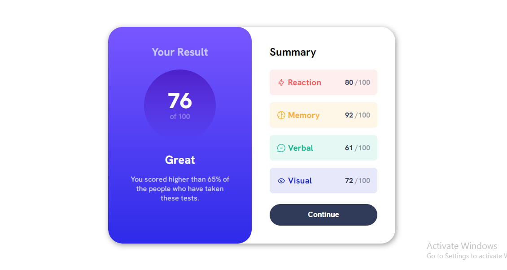

# Frontend Mentor - Results summary component solution

This is a solution to the [Results summary component challenge on Frontend Mentor](https://www.frontendmentor.io/challenges/results-summary-component-CE_K6s0maV). Frontend Mentor challenges help you improve your coding skills by building realistic projects. 

## Table of contents

- [Links](#links)
- [Built with](#built-with)
- [Author](#author)

## Links

- [Solution URL](https://github.com/Mary83-ops/Results-summary-component.git)
- [Live Site URL](https://mary83-ops.github.io/Results-summary-component/)

## Built with

- Semantic HTML5 markup
- CSS custom properties
- CSS Grid
- Mobile-first workflow

## Author

- Frontend Mentor - [@Mary83-ops](https://www.frontendmentor.io/profile/Mary83-ops)
- Twitter - [@MaryannNabwire](https://www.twitter.com/MaryannNabwire)